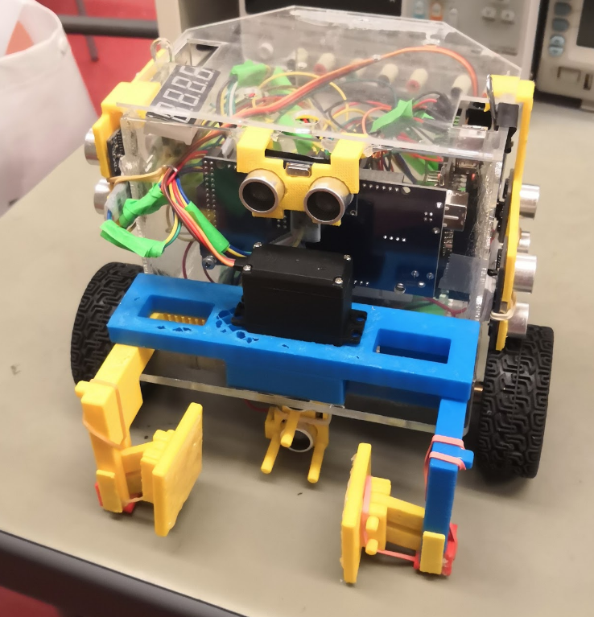
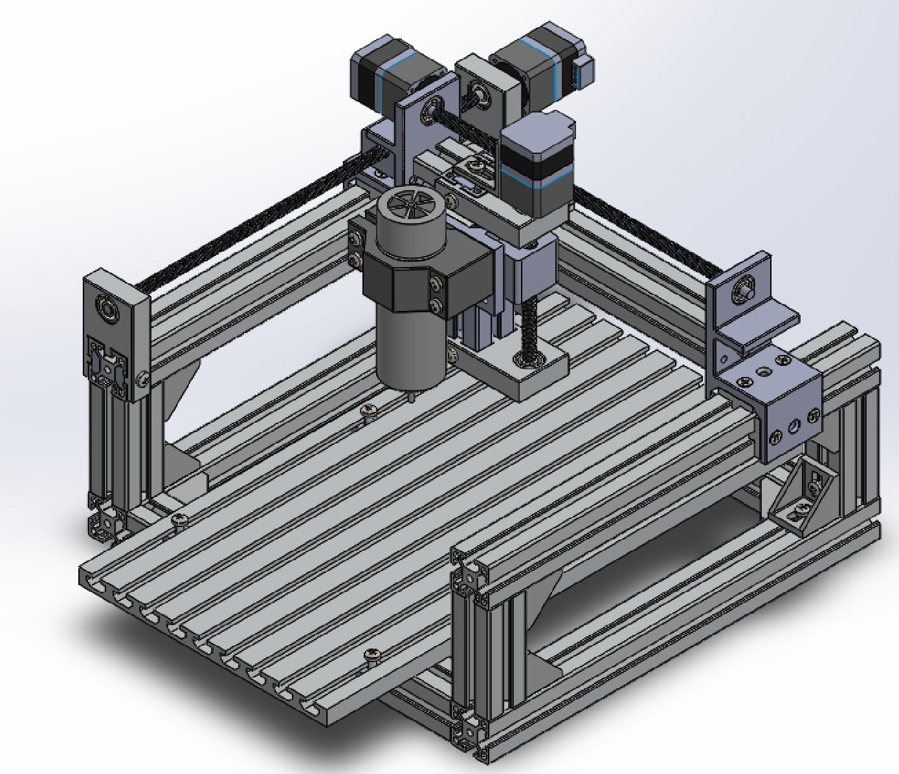
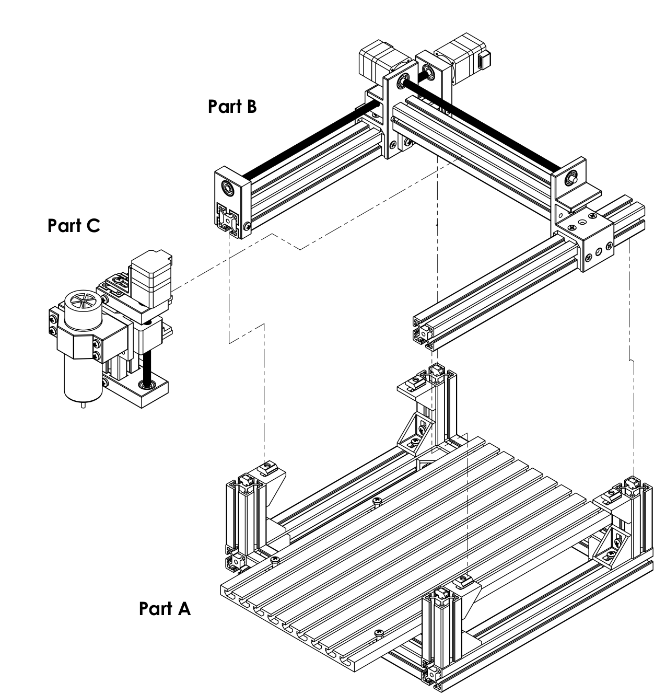
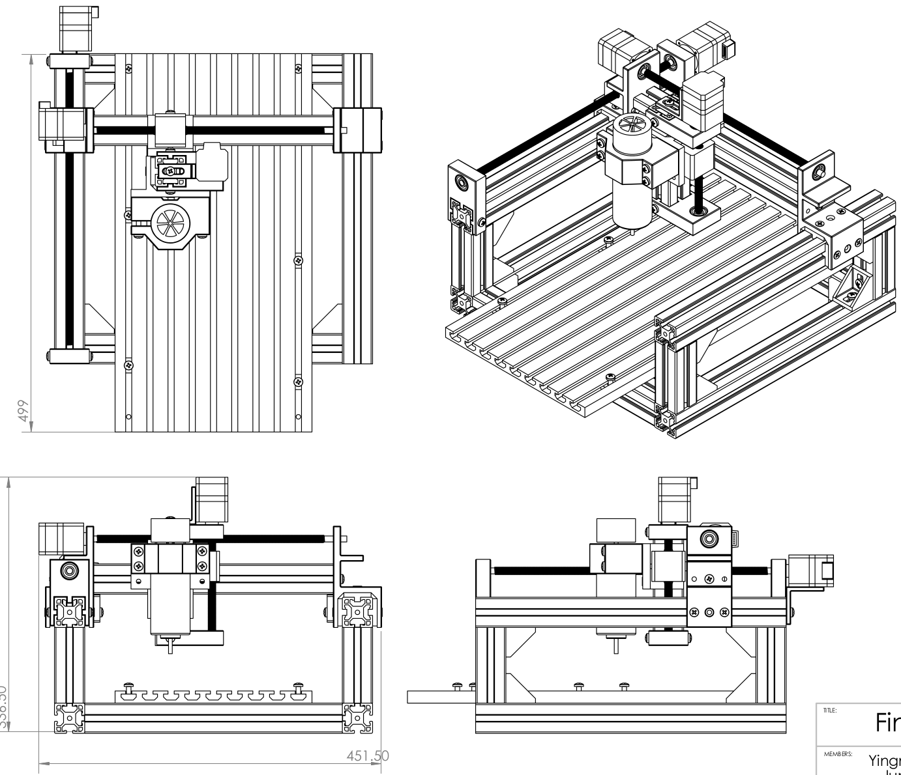

<!-- ## Computer Engineering and Robotics Projects -->

## Mechancial Engineering Projects

### Arduino Autonomous Robot

Designed a robot to deliver a small load through a walled-maze. The robot can localize itself after being placed randomly in the maze. The robot can find the shortest path to the loading zones, navigate itself to target locations and avoid obstacles.

* Designed and manufactured the gripper with 3D printing.
* Programmed Robot localization, navigation and low-level control. 

  
 Pick up object and Navigation(Speed X5):

 

 
 

### CNC Milling Machine Design
Designed a CNC milling machine and modeled the mechanical structure with SolidWorks.

  
 
  

 

### Lab projects
Robot Arm Control
 

 

 

CartPole balance control

